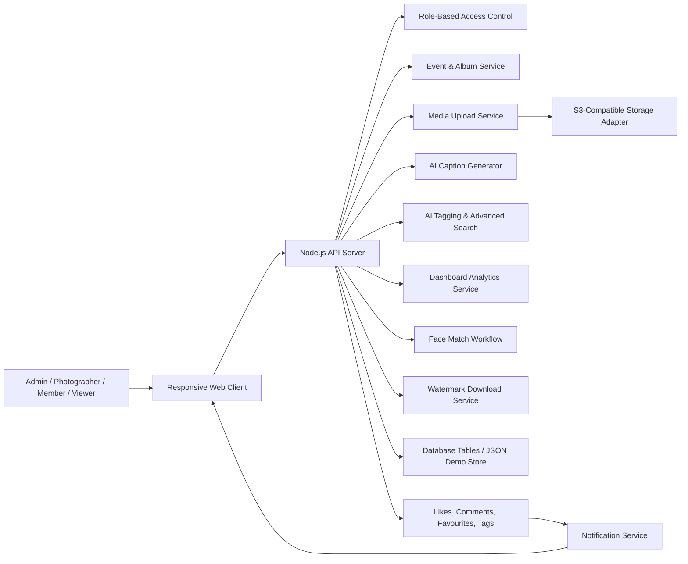

# Architecture Diagram

## System Flow

1. The browser loads the static UI from the Node.js server.
2. The user chooses a role and app state is retrieved using `/api/dashboard`.
3. The API authorizes actions using RBAC and returns only permitted media.
4. Event creation writes a new event record to the database.
5. Media uploads create `media_items` records, generate smart tags, and optionally upload assets to S3.
6. AI caption requests generate a caption string for the selected media.
7. User interactions like likes, comments, favourites, and tags create notifications.
8. The analytics service summarizes media metrics, tag trends, upload distribution, and contributors.
9. Download requests package media with dynamic watermark text based on event and role.

## Data Components

- `users` stores profile, email, password, and role.
- `events` stores album metadata, category, access, cover image, and creator.
- `media_items` stores uploaded file metadata, visibility, storage keys, captions, and uploader.
- `media_tags` stores smart tags linked to media.
- `likes`, `favourites`, `comments`, and `user_tags` store social interactions.
- `notifications` stores the in-app notification feed.
- `face_references` supports reference selfie matching in demo flow.

## Frontend Components

- `frontend/client/index.html` — main page structure and panels
- `frontend/client/styles.css` — responsive layout and card styling
- `frontend/client/app.js` — application state, rendering, API integration, and UX logic

## Backend Components

- `backend/server/index.js` — API endpoints, RBAC, media handling, notifications, caption generation, analytics, and optional S3 storage
- `backend/server/data/database.json` — demo content store for users, events, media, and notifications

## Production Upgrade Path

- Replace `data/database.json` with a relational database using `required-deliverables/database/schema.sql`.
- Use AWS S3 for media storage with presigned URLs and private bucket access.
- Swap demo caption generation for a real ML inference API.
- Replace face-match heuristics with proper vector embeddings and consent flows.
- Add WebSocket or SSE for real-time notifications.
- Add authentication and session management to replace the role selector.
